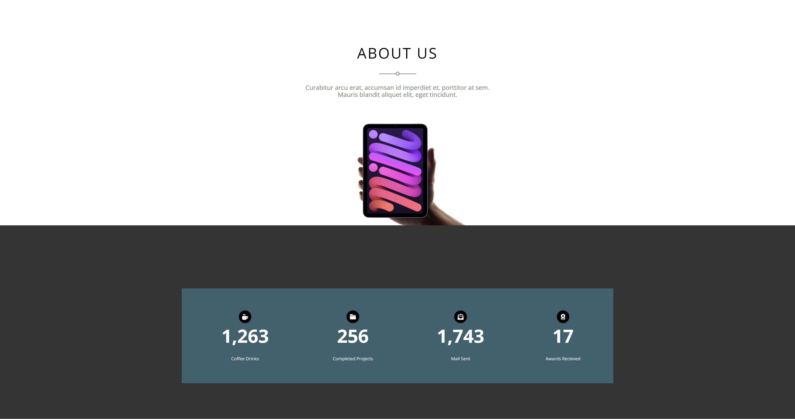
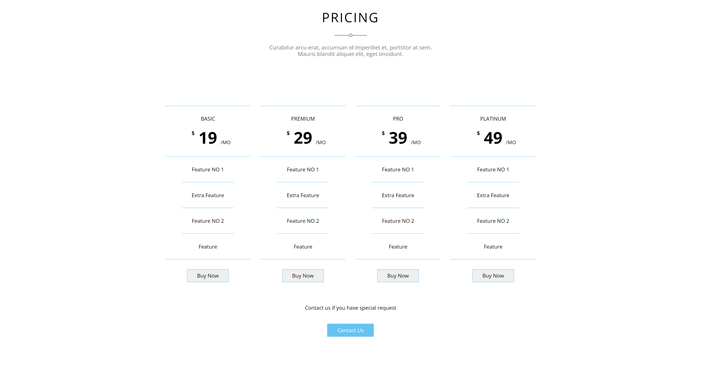

# Elzero - HTML - CSS template 3

This is a template from [Elzero Web School](https://elzero.org/).

## Table of contents

- [Overview](#overview)
  - [Screenshot](#screenshot)
  - [Links](#links)
- [My process](#my-process)
  - [Built with](#built-with)
  - [What I learned](#what-i-learned)
  - [Continued development](#continued-development)
- [Author](#author)
- [Acknowledgments](#acknowledgments)

## Overview

### Screenshot

### Links

- Live Site URL: [Live](https://template2-by-mido.netlify.app/)

## My process

### Built with

- Semantic HTML5 markup
- CSS custom properties
- Flexbox
- CSS Grid
- Mobile-first workflow

### What I learned

This was the second HTML - CSS project I make and it was a life changing for me to make the second website by my own after learning HTML - CSS.
It basicly taught me more of the basics of workflow and making websites.

### Continued development

Now looking forward to making new templates and websites to increase my HTML - CSS code before going into JS.

## Author

- Website - [Mohamed](https://www.mohamed-dev.netlify.app)

## Acknowledgments

The most usefull tip I've heard is taking the problem and dividing it to smaller problems, this approach makes it easier for you to approach solutions and make things work!

### Outro

Thank you for reading! I hope you found the code usefull.
